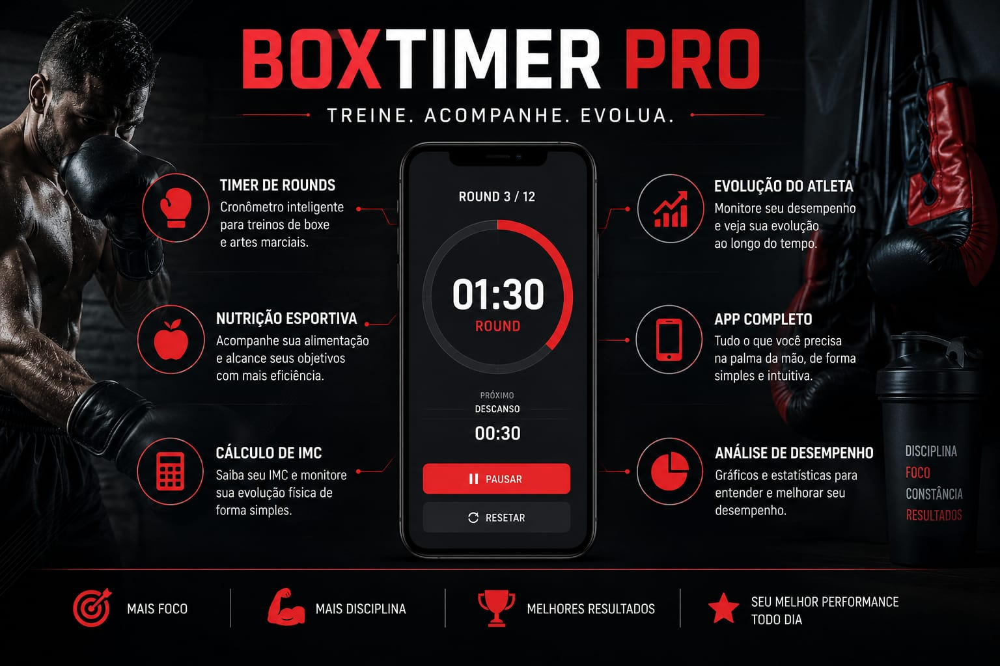

# 🥊 ForUs BoxTimer Pro

## 🚀 Sobre o Projeto

O **ForUs BoxTimer Pro** é uma plataforma desenvolvida para treinadores, atletas e praticantes de boxe que desejam acompanhar sua evolução física, avaliações, alimentação e desempenho esportivo em um único sistema.

A plataforma reúne ferramentas profissionais de acompanhamento esportivo, gestão de atletas e planejamento físico.

---

## ✨ Funcionalidades

### 👤 Cadastro de Atletas

* Cadastro completo de usuários
* Armazenamento em nuvem com Firebase
* Histórico individual

### 📋 Avaliação Física

* Peso corporal
* Altura
* IMC automático
* Classificação física
* Bioimpedância
* Dobras cutâneas
* Observações do treinador

### 🍽️ Nutrição Esportiva

* Plano alimentar personalizado
* Objetivos:

  * Hipertrofia
  * Emagrecimento
  * Manutenção
* Macronutrientes em gramas
* Sugestões alimentares

### 📈 Histórico de Evolução

* Registro das avaliações
* Comparação de resultados
* Acompanhamento da evolução física

### 🥊 Timer Profissional

* Cronômetro de rounds
* Tempo de descanso
* Controle automático de rounds
* Campainha de início e fim

### 👨‍🏫 Área do Treinador

* Gestão de atletas
* Acompanhamento individual
* Histórico completo

### 🌎 Comunidade

* Feed de atividades
* Compartilhamento de evolução
* Interação entre usuários

### 💎 Sistema Premium

* Ativação por código
* Controle de validade
* Renovação de assinaturas
* Gestão de assinantes
* Recursos avançados exclusivos

### ☁️ Backup em Nuvem

* Firebase Firestore
* Sincronização online
* Segurança dos dados

### 📱 Aplicativo Instalável (PWA)

* Funciona como aplicativo
* Instalação em Android
* Instalação em computador
* Uso simplificado

---

## 🔒 Segurança

O sistema utiliza:

* Firebase Authentication
* Cloud Firestore
* Controle de assinaturas
* Regras de segurança personalizadas
* Área administrativa protegida

---

## 🛠️ Tecnologias Utilizadas

* HTML5
* CSS3
* JavaScript
* Firebase
* Firestore Database
* GitHub Pages
* Progressive Web App (PWA)

---

## 🎯 Objetivo

Fornecer uma plataforma profissional para:

* Treinadores de Boxe
* Academias
* Atletas Amadores
* Atletas Competitivos
* Projetos Sociais
* Equipes Esportivas

---

## 💎 Plano Premium

Recursos exclusivos:

✅ Avaliação física completa

✅ Dieta personalizada

✅ Bioimpedância

✅ Dobras cutâneas

✅ Histórico ilimitado

✅ Área do treinador

✅ Dashboard profissional

✅ Backup dos dados

---

## 📌 Status do Projeto

### Versão Atual

**Beta Fechado v1.0**

### Fase Atual

🔹 Testes com usuários reais

🔹 Validação de funcionalidades

🔹 Coleta de feedback

🔹 Ajustes de performance

---

## 🚀 Roadmap

### Próximas Atualizações

* Dashboard avançado
* Relatórios em PDF
* Exportação de avaliações
* Estatísticas de desempenho
* Ranking de atletas
* Notificações inteligentes
* Integração com pagamentos
* Aplicativo Android dedicado

---

## 👨‍💻 Desenvolvedor

**André Lucas Moraes**

Criador do projeto ForUs BoxTimer Pro.

---

## 🥊 ForUs BoxTimer Pro

Treino, nutrição, avaliação física, evolução e comunidade esportiva em uma única plataforma.
